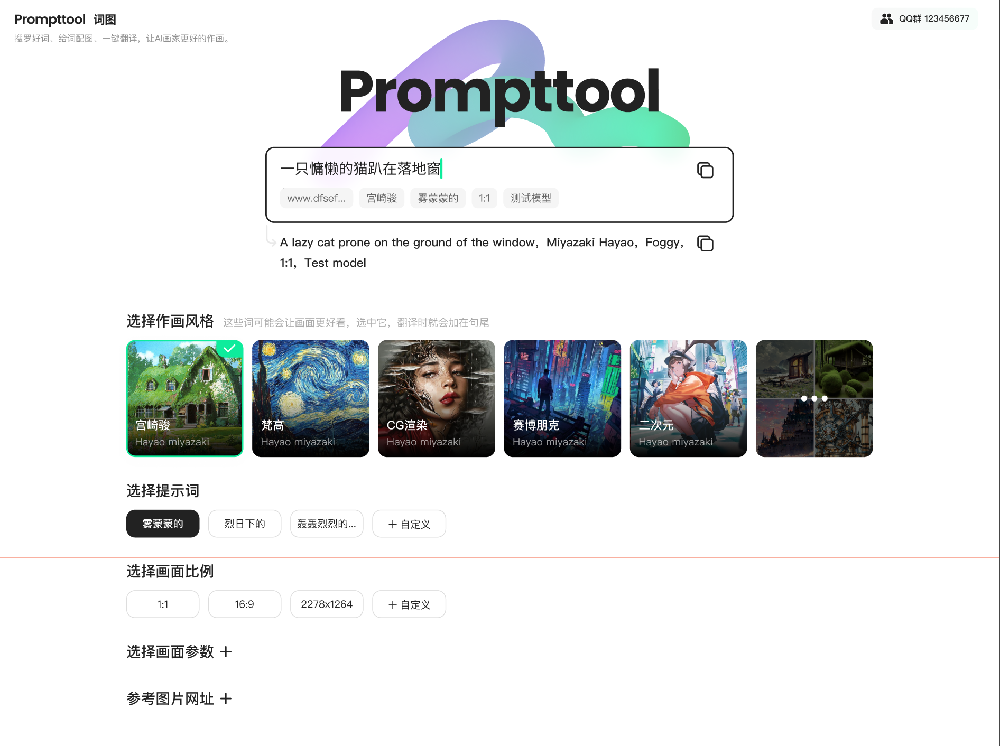

<p align='center'>
 	<h1 align='center'>
    Midtool 米涂
	</h1>
</p>


## 项目描述

- 🔥 搜罗好词、词图预览、一键翻译，让AI画家更好的作画

### 运行项目

```bash
git clone 

pnpm i # 如果你没装过 pnpm, 可以先运行: npm install -g pnpm

pnpm run dev
```

### 项目预览

<div style="display: flex; justify-content: center">
</img>
</div>

